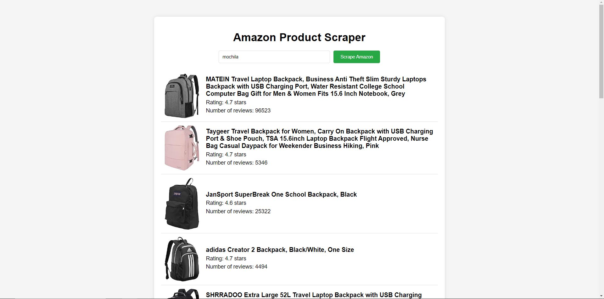

# Amazon Web Scraper

API created to solve the following technical challenge:

**Objective:** Create a simple script to scrape Amazon product listings from the first page of search results for a given keyword.

## Task Requirements

### 1. Backend/API (Node.js):
- **Set up a Node.js project with the necessary dependencies (express, axios, and JSDOM).**
- **Write a script using axios to fetch the contents of the Amazon search results page for a given keyword.**
- **Use JSDOM to parse the HTML content and extract the following details for each product listing on the first page:**
  - Product Title
  - Rating (stars out of five)
  - Number of reviews
  - Product image URL
- **Create an endpoint `/api/scrape` where a GET request with a query parameter `?keyword=yourKeyword` initiates the scraping process and returns the extracted data in JSON format.**

### 2. Frontend (HTML, CSS, Vanilla JavaScript):
- **Develop a simple webpage with:**
  - An input field to enter the search keyword.
  - A button to initiate the scraping process.
- **Style the webpage to be user-friendly and presentable.**
- **Implement JavaScript to make an AJAX call to the backend endpoint when the button is clicked, and display the results formatted cleanly on the page.**

### Documentation

- **Provide comments within your code to offer clarity on your logic and process.**
- **Include a README.md file with the setup and running instructions.**

### Considerations

- **Ensure you handle errors gracefully both on the backend and frontend.**
- **Provide clear instructions on how to run the application.**
- **The cleaner and more functional the code is, the better.**

## Techs used
- Node.js 21.6.1;
- Express.js 4.19.2;
- Axios 1.7.2;

## Requirements

In order to run this project you have to install:

- [NPM and Node.js](https://docs.npmjs.com/downloading-and-installing-node-js-and-npm);

## How to run 

```bash
git clone https://github.com/AlexandrePossari/amazon-webscraper.git
cd amazon-webscraper
npm start
```

## API Documentation
After running the project, visit http://localhost:8080/ in your browser to access the UI



And there is the API that scrapes Amazon page:

**GET /api/scrape?keyword=keyword_to_be_searched**: do the scrape process and returns a JSON list of the following objects:

``` json
"title": "product title",
"rating": 4.6,
"numberOfReviews": 200,
"imageURL": "https://image.url",
"link": "https://image.link"
```

## Project Folder Structure
```
. 
├── readmecontent                            
└── src                                  
    ├── controllers                       
    ├── public                        
    ├── routes                            
    └── views                            
```

The `readmecontent` folder contains readme images.

The `src` folder contains the source code. 

The `controllers` folder has the controlllers that process incoming requests and return appropriate responses.

The `public` folder stores static assets, like CSS or Javascripts scripts.

The `routes` folder contains the route handlers for the endpoints.

The `views` folder should contain HTML templates that define the structure of the UI.

## Critique

The project need unit tests, couldnt add due to time.
